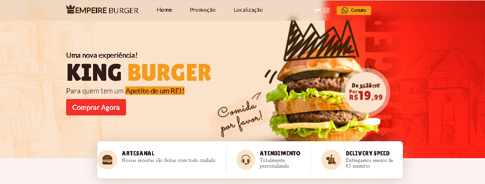

# EmpireBurger
Resolução do desafio Empire-burger do BrChallenges

    <a href="#objetivo">Objetivo</a> •
    <a href="#tecnologias">Tecnologias</a> • 

<h2 align="center">
    
</h2>

    Essa é uma descrição breve sobre o projeto, você pode informar as
    seguintes coisas: Pretenção do projeto, Autor e alguns links 
    importantes.
    Esse projeto foi um desafio da plataforma <a href="https://www.brchallenges.com/">BrChallenges</a>, onde utilizamos
    um protótipo figma do autor <a href="https://www.behance.net/tiagofenixe9d9">Tiago Alves</a> como modelo de
    desenvolvimento.

<h2>Objetivo</h2>
<h2 id="objetivo">✔️ Objetivo</h2>

    Esse projeto é uma landing page de uma hamburgueria fictícia chamada Empire Burger, nela há seções sobre as ofertas especiais, horário de funcionamento,     cardápio contendo os ingredientes e preços, cards com os feedbacks dos clientes e a localização do estabelecimento. O seu desafio é construir este layout     e deixá-lo o mais próximo possível do design.
    Esse projeto é uma landing page de uma hamburgueria fictícia chamada Empire Burger, nela há seções sobre as ofertas especiais, horário de   funcionamento, cardápio contendo os ingredientes e preços, cards com os feedbacks dos clientes e a localização do estabelecimento. O seu desafio é construir este layout e deixá-lo o mais próximo possível do design.

    Você pode usar qualquer ferramenta que deseja para ajudá-lo a completar o desafio, não será avaliado o código, mas sim a fidelidade ao layout e a             implementação das funcionalidades solicitadas. Então, se você tem algo que gostaria de praticar, sinta-se à vontade para tentar.

<h2>Tecnologias</h2>

    Para desenvolver esse projeto, optei por utilizar os conceitos basicos de desenvolvimento front-end, sendo eles, html, css e js.  
    O html foi utilizado para fazer a marcação de textos na página, já o css foi utilizado para estilizar e definir os tamanhos dos itens da página e
    o javascript foi utilizado para deixar o horário de funcionamento do estabelecimento dinâmico, ou seja, o o banner "horário de funcionamento" será
    alterado dinamicamente de acordo com o horário do dispositivo do cliente.
Existem 3 tipos de nível do desafio (Fácil, Médio e Difícil), onde o desenvolvedor tem a possibilidade de escolher a dificuldade de acordo com seu nível de conhecimento.

<h2 id="Tecnologias">🛠Tecnologias</h2>

As seguintes ferramentas foram usadas na construção do projeto:

- [Node.js](https://nodejs.org/en/)
- [HTML](https://developer.mozilla.org/pt-BR/docs/Web/HTML)
- [CSS](https://developer.mozilla.org/pt-BR/docs/Web/CSS)

<h2 id="funcionalidades">⚙️ Funcionalidades</h2>

- [x] Ao clicar em um item do menu, o usuário deverá ser levado para a seção correspondente.
- [x] Horário de funcionamento de acordo com as horas do dispositivo do cliente.
- [x] Botão de back-to-top no canto inferior direito da página.
- [x] Responsividade.